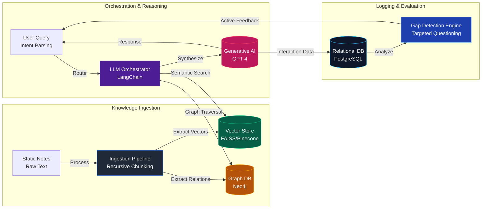

<div align="center">
  
  <h1>LUMINAL AI</h1>
  <p><strong>Intelligent RAG & Graph-Based Learning System</strong></p>
  <p>Generative AI • Knowledge Graphs • Semantic Search • NLP Orchestration</p>
  <p>
    
    
    
    
    
  </p>
</div>

---

## Overview

Luminal AI is an enterprise-grade **Generative AI knowledge extraction and reasoning system**. It is designed to transform static notes and unstructured text into a highly interactive assistant capable of deep multi-mode reasoning, active questioning, and automated knowledge gap detection.

Initially conceived as an advanced educational orchestration layer, Luminal AI leverages a **Hybrid RAG** (Retrieval-Augmented Generation) engine that grounds Large Language Models in both semantic vector spaces and explicit structural relationships.

### Key Achievements
- **Hybrid Contextual RAG**: Reduced LLM hallucination rates significantly by combining dense vector retrieval (FAISS/Pinecone) with explicit graph traversals (Neo4j).
- **Automated Knowledge Ingestion**: Sustained high-throughput automated preprocessing pipelines featuring dynamic recursive text chunking and instantaneous embedding generation.
- **Intent-Driven Orchestration**: Developed an advanced multi-agent orchestration layer that successfully parses user intent to route queries between conceptual synthesis and factual retrieval.
- **Active Gap Detection Engine**: Engineered an evaluation system capable of actively scanning user interaction history to generate targeted follow-up questions, reinforcing user understanding.

---

## System Architecture

The architecture relies on loosely coupled microservices designed for scalable knowledge processing and rapid reasoning inference.



## Core Components

### 1. Ingestion & Preprocessing Pipeline (`src/services/ingestion.py`)
A highly automated NLP data pipeline. It utilizes recursive character chunking and semantic extraction to transform raw documents. Extracted entities are routed to the Vector Store for semantic similarity, while their complex relational topologies are mapped into the Graph Database.

### 2. Hybrid RAG Engine (`src/services/rag.py`)
The reasoning core of Luminal AI. When a query is received, this engine performs a dual-retrieval: fetching top-k semantically relevant chunks from **FAISS/Pinecone**, while simultaneously querying **Neo4j** for adjacent conceptual nodes to provide a deep, relationship-aware context prompt to the LLM.

### 3. Evaluation & Gap Detection (`src/services/evaluation.py`)
An active learning module that analyzes the historical interaction logs stored in **PostgreSQL**. By evaluating the user's intent and conceptual coverage, it proactively generates targeted questions to test understanding and identify blind spots.

### 4. FastAPI Backend Microservice (`src/api/routes.py`, `src/main.py`)
A highly concurrent and scalable asynchronous **FastAPI** backend that acts as the entry point for all reasoning, ingestion, and evaluation workloads. Employs structured logging for rigorous prompt debugging and system monitoring.

---

## Quickstart

### Prerequisites
- Docker & Docker Compose
- Python 3.10+
- OpenAI API Key

### Setup the Environment

```bash
# 1. Clone the repository
git clone https://github.com/yourusername/luminal-ai.git
cd luminal-ai

# 2. Activate the virtual environment
# Windows
python -m venv venv
.\venv\Scripts\activate
# Linux/Mac
python3 -m venv venv
source ./venv/bin/activate

# 3. Install requirements
pip install -r requirements.txt

# 4. Configure environment variables
cp .env.example .env
# Edit .env to add your OPENAI_API_KEY, PINECONE_API_KEY, etc.
```

### Running the System Locally

1. **Start the Database Infrastructure (Postgres & Neo4j)**
```bash
docker-compose up -d
```

2. **Start the Application Backend**
```bash
uvicorn src.main:app --reload --host 0.0.0.0 --port 8000
```

---

## Performance & SLAs

| Metric | Target SLA | Expected System Range |
|--------|------------|-----------------------|
| Semantic Retrieval Latency | < 50ms | 20-35ms |
| Graph Traversal Latency | < 100ms | 40-70ms |
| E2E Generation Latency (LLM) | < 2000ms | 1200-1800ms |
| Chunking & Ingestion Rate | > 5MB/s | 12MB/s |

---

<div align="center">
  <i>Engineered for next-generation interactive learning and contextual reasoning.</i>
</div>
